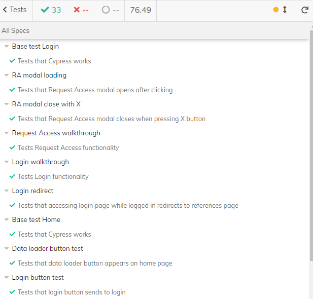
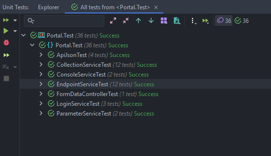

# Development Environment

## Technologies to Replicate

  

- `.NET 5 SDK v5.0.402`
- `NodeJS v14.18.0` for `npm` usage
- `Vue CLI v4.5.13`
- `Microsoft SQL Server 2019 v15.0.2000.5 for database support`
- `Microsoft SQL Server Management Studio 18 v18.9.2 for database management`
- `Docker Desktop 4.4.4`
- `Cypress v9.5.4` (installed on npm install)

## Required IDEs
- IDEs used for development
    - **Visual Studio 2019** - back-end development
    - **Visual Studio Code** - front-end development
- These are the IDEs used by the team, but neither are specifically required for development

## Folder structure
    .
    ├── databases\                      # Folder to store database backups
        ├── CheetahDB.bak                   # Backup of main database
        └── CheetahDBTest.bak               # Backup of test database
    ├── dotnet\                         # Back-end folder for all .NET files
        ├── Portal\
            ├── Portal\
                ├── Classes\
                    └── MailSettings.cs                 # Class that gets and sets each form input that gets posted from the frontend
                ├── Controllers\
                    ├── ApiJsonController.cs            # Web API controller for getting json API endpoint data
                    ├── CollectionController.cs         # Web API controller for sending info stored in the database to the front-end
                    ├── ConsoleController.cs            # Web API controller for sending HTTP calls to Accutech and returning the response to the front-end
                    ├── EndpointController.cs           # Web API controller for putting endpoint edits into the database
                    ├── FormDataController.cs           # Web API controller that contains logic for sending an email to a specified reciever
                    ├── LoginController.cs              # Web API controller that contains logic for logging in through Cheetah calls
                    ├── ParameterController.cs          # Web API controller that contains logic for editing parameter description from the database
                ├── Extensions\
                    └── ApiJsonExtensions.cs            # Helper class containing static methods to load and organize data from JSON file
                ├── Models\
                    ├── ApiJson.cs                      # Class for modeling the JSON components to load into the database
                    ├── CheetahDBContext.cs             # Class for modeling the context of the database in the back-end of our app
                    ├── Collection.cs                   # Class for modeling the 'Collections' table in the database in context to the back-end of our app
                    ├── Endpoint.cs                     # Class for modeling the 'Endpoints' table in the database in context to the back-end of our app
                    ├── LoginResponse.cs                # Class for modeling the response recieved from Accutech's servers when a user attempts to log in
                    ├── Parameter.cs                    # Class for modeling the 'Parameters' table in the database in context to the back-end of our app
                    ├── Request.cs                      # Class for modeling the 'Requests' table in the database in context to the back-end of our app
                    ├── Response.cs                     # Class for modeling the 'Responses' table in the database in context to the back-end of our app
                    ├── SchemasReference.cs             # Class for modeling the 'SchemasReferences' table in the database in context to the back-end of our app
                    └── Session.cs                      # Class for modeling the 'Sessions' table in the database in context to the back-end of our app
                ├── Services\
                    ├── ApiJsonService.cs               # Class that contains teh logic for the ApiJsonController controller
                    ├── CollectionService.cs            # Class that contains the logic for the CollectionController controller
                    ├── ConsoleService.cs               # Service that extends the IConsoleService interface that lays out methods for making HTTP calls to the Cheetah API
                    ├── EmailService.cs                 # Service that extends the IEmailService interface and lays out the body of the email to be sent
                    ├── EndpointService.cs              # Class that contains the logic for the EndpointController controller
                    ├── IApiJsonService.cs              # Interface that allows the ApiJsonController to use methods available in ApiJsonService
                    ├── ICollectionService.cs           # Interface that allows the CollectionController to use methods available in CollectionService
                    ├── IConsoleService.cs              # Interface that contains tasks to asynchronsously make console calls to the Cheetah API
                    ├── IEmailService.cs                # Interface that contains a task that asynchronously sends an email
                    ├── IEndpointService.cs             # Interface that allows the EndpointController to use method available in EndpointService
                    ├── ILoginService.cs                # Interface that contains tasks to asynchronously login to Cheetah servers
                    ├── IParameterService.cs            # Interface that allows the ParameterController to use methods available in ParameterService
                    ├── LoginService.cs                 # Service that extends the ILoginService interface and lays out methods for logging in
                    └── ParameterService.cs             # Service that extends the IParameterService that lays out methods for editing endpoint descriptions
                ├── ViewModels\
                    ├── CollectionViewModel.cs                # View Model that contains the context of the Collections stored in the database
                    ├── ConsoleViewModel.cs           # View Model that contains the context of each parameter and the url of console calls made from the front-end
                    ├── EmailFormViewModel.cs           # View Model that contains the getters and setters for all of the elements to be sent in the email
                    ├── EndpointViewModel.cs            # View Model that contians the context of the Endpoints stored in the database
                    ├── LoginViewModel.cs               # View Model that contains the context of the Login to be used by Login Service
                    ├── ParameterViewModel.cs           # View Model that contains the context of the Parameters stored in the database
                    ├── RequestViewModel.cs           # View Model that contains the context of the Requests stored in the database
                    ├── ResponseViewModel.cs           # View Model that contains the context of the Responses stored in the database
                    ├── SchemaReferenceViewModel.cs           # View Model that contains the context of the SchemaReferences stored in the database
                    └── SidebarViewModel.cs             # View Model that contains the context of the links that are featured in the side bar of the front-end References page
                ├── Properties\launchSettings.json  # Json file that specifies where the back-end is running
                ├── appSettings.json                # Json file that contains the root URL for the example endpoint data and the settings for the email functionality
                ├── Startup.cs                # C# files that contains all of the information for what the back-end of our project opens/does/includes on startup
                └── Portal.csproj                   # C# project containing the classes, controllers, services, models, and the launchSettings and appSettings json files
            ├── Portal.Test\
                ├── ApiJsonTest.cs                  # Class of unit tests for ApiJson data loader classes
                ├── CollectionServiceTest.cs        # Class of unit tests for the CollectionService.cs service
                ├── ConsoleServiceTests.cs          # Class of unit tests for the ConsoleService.cs service
                ├── EndpointServiceTest.cs          # Class of unit tests for the EndpointService.cs service
                ├── FormDataController.cs           # Class of unit tests for the FormDataController.cs controller
                ├── LoginServiceTests.cs            # Class of unit tests for the LoginService.cs service
                ├── ParameterServiceTests.cs        # Class of unit tests for the ParameterService.cs service
                ├── testconfig.json                 # Json file that holds the information for the testing environment
                └── Portal.Test.csproj              # C# project that contains all of the test classes and the testconfig.json file
            └── Portal.sln                      # Contains information about what needs to be compiled
        ├── Dockerfile                      # Dockerfile to build back-end development image
        └── DockerfileExternal              # Dockerfile to build back-end development image through an external repository
    ├── vue\                            # Front-end folder for all vue files
        ├── public\                         # Files that are served raw and accessible in its plain URL
        ├── cypress\                           # Files relating to the Cypress test running library
            ├── integration\                         # Test files for the front-end code for Cypress to run
                ├── login_spec.js                       # Javascript file that contains cypress tests for the login page and functionality
                ├── navbar_spec.js                      # Javascript file that contains cypress tests for the navbar component and button
                ├── references_spec.js                  # Javascript file that contains cypress tests for the references page and various functionalities on that page
                ├── workflows_spec.js                   # Javascript file that contains cypress tests for the workflows page
        ├── src\                            # Source files for vue front-end
            ├── assets\                         # Asset files for the vue front-end
            ├── components\                     # HTML components to import in vue files
                ├── Navbar.vue                      # Component that contains HTML for the navigation bar featured on App.vue
                ├── Footer.vue                      # Component that contains HTML for the footer featured on App.vue
                └── Sidebar.vue                     # Component that contains HTML for the References sidebar
            ├── css\                            # Folder containing CSS files for Tailwind CSS
                ├── tailwind.css                      # File for configuring Tailwind CSS
            ├── repositories\                   # Folder containing repository pattern Javascript files
                ├── CollectionRepository.js         # Javascript file that points to our web api object "Collection" and creates methods for it
                ├── ConsoleRepository.js            # Javascript file that points to our web api object "Console" and creates methods for it
                ├── DataLoaderRepository            # Javascript file that points to our web api object "ApiJson" and creates methods for it
                ├── EndpointRepository.js           # Javascript file that points to our web api object "Endpoint" and creates methods for it
                ├── FormDataRepository.js           # Javascript file that points to our web api object "FormData" and creats a post method
                ├── LoginRepository.js              # Javascript that points to our web api object "Login" and creates methods to handle login
                ├── ParameterRepository.js          # Javascript file that points to our web api object "Parameter" and creates methods for it
                ├── Repository.js                   # Javascript file that points to the url that our backend is running on
                └── RepositoryFactory.js            # Javascript file that sets environments for either unit testing or running the project
            ├── router\
                └── index.js                        # JavaScript file to declare routes and paths
            ├── views\                          # Folder to house the front-end HTML pages
                ├── Home.vue                        # HTML for the Home page
                ├── Login.vue                       # HTML and Javascript logic for the Login page
                ├── References.vue                  # HTML and Javascript logic for the References page
                ├── Workflows.vue                  # HTML for the Workflows page
                └── ReferencesLanding.vue           # HTML for the References landing page
            ├── App.vue                         # Main HTML template for Vue pages
            └── main.js                         # JavaScript file for Vue, Bootstrap, etc. imports
        ├── Dockerfile                      # Dockerfile to build front-end development image
        ├── DockerfileExternal              # Dockerfile to build front-end development image through an external repository
        ├── tailwind.config.js              # Configuration file for Tailwind CSS that lays out more in depth information for how we'd like Tailwind to function
        ├── cypress.json              # Configuration file for Cypress that sets different default value and behaviors when running tests
        └── package.json                    # JSON file to store vue config data and npm script aliases
    ├── docker-compose.yml              # YAML file to build all Docker containers for local development internally
    └── README.md                       # Markdown file that briefly explains the project and list release dates

    [Truncated for brevity, only relevant folders/files were highlighted.]

## Important files
**appSettings.json** - This file stores all of the configuration settings for the Portal.csproj project

**testconfig.json** - This file stores all of the configuration settings for the Portal.Test.csproj project

**launchSettings.json** - This files stores the launch configuration settings for the back-end including what port it will run on

**package.json** - This file stores all dependencies needed for the project, dependencies are stored in json format with their name and version number to be installed by `npm`

**Dockerfiles** - Dockerfiles are used to build the development images for both front and back-end; these are mostly used with the Docker repo and docker-compose, but can be built by themselves

## Replicating / Testing the Environment
### Building and running
- Clone the project repository from BitBucket
    - `git clone https://bitbucket.org/accutechdev/bsu.developer-portal/src/master/ bsu.developer-portal`
#### &emsp;Gathering required technologies:
- Download Microsoft SQL Server 2019 from [microsoft.com](https://www.microsoft.com/en-us/sql-server/sql-server-downloads)
- Download Microsoft SQL Server Management Studio 18 from [docs.microsoft.com](https://docs.microsoft.com/en-us/sql/ssms/download-sql-server-management-studio-ssms?view=sql-server-ver15)
- Download .NET 5 SDK from [dotnet.microsoft.com](https://dotnet.microsoft.com/download/dotnet/5.0)
    - Make sure to download the correct SDK for your machine (Windows, Linux, Mac)
- Download the latest LTS of Node.js from [nodejs.org](https://nodejs.org/en/download/)
    - Again, make sure to downlaod the correct installer for your machine
- After installing node, open a CLI of your choice, run the following command to install Vue CLI
    - `npm install -g @vue/cli`

#### &emsp;Database:
- Open SQL Server Management Studio and connect to your Desktop server
- Right click on `Databases` and select `Restore Database`
- Select the radio button labeled `Device` and click the `Browse (...)` button next to the input box
- In the window that comes up, select `File` from the dropdown menu
- Select any existing paths in the `Browse Media` box and click `Remove`
- Select `Add`
- Find the project repository in the file structure that comes up, select the 'CheetahDB.bak' database backup file, and select `Ok`
- Select the 'CheetahDB.bak' file path in the `Browse Media` box and click `Ok`
- In the restore database window, write 'CheetahDB' in the database input box if it's not already inputed
- Click `Ok` to restore the CheetahDB database from the backup file
- If there are any issues, check to make sure the proper connection string is used in the back-end file "Startup.cs"
    - "CheetahDbLocal" for local machine database and "CheetahDbDocker" for a database in a Docker container.

#### &emsp;Back-end:
- In a CLI, move into the *\dotnet\Portal\Portal* folder and first build the project .dll
    - `dotnet build "Portal.csproj"`
- Then, move into the *\bin\Debug\net5.0* folder to run the .dll
    - `dotnet run Portal.dll`
- The back-end should spin up, and in a browser you can go to http://localhost:5000 and should see the back-end swagger page
**OR**
- Open the project solution in Visual Studio 2019
    - Select 'Portal' from the run dropdown menu and click the run button
    - http://localhost:5000 will open in your default browser

#### &emsp;Front-end:
- In a CLI, move into the *\vue* folder and first install the dependencies
    - `npm install`
- Then, in the same folder, start the front-end with npm
    - `npm run serve`
- The front-end should spin up, and in a browser you can go to http://localhost:8080 and see the front-end web application pages
**OR**
- Open the 'vue' folder in Visual Studio Code
    - Hit 'Ctrl + ~' to open a shell in the vue folder
    - Run the command `npm run serve`
    - Navigate to http://localhost:8080

### Building and running with Docker
- Startup Docker Desktop on your computer to start the Docker Engine
- Clone the project repository from BitBucket
    - `git clone https://bitbucket.org/accutechdev/bsu.developer-portal/src/master/ bsu.developer-portal`
- Run the following docker-compose command in the root folder of the repository (where docker-compose.yml is):
    - `docker-compose up --build`
    - This might take some time for the initial build.
    - If Docker prompts to share folder(s), confirm them.
- If you want to rebuild from scratch, try using --nocache option.
    - `docker-compose build --no-cache`
    - Then running `docker-compose up`

### Running code tests
#### &emsp;Test Database:
- Running tests for the backend relies on having a working copy of the CheetahDBTest database
    - Open SQL Server Management Studio and connect to your Desktop server
    - Right click on `Databases` and select `Restore Database`
    - Select the radio button labeled `Device` and click the `Browse (...)` button next to the input box
    - In the window that comes up, select `File` from the dropdown menu
    - Select any existing paths in the `Browse Media` box and click `Remove`
    - Select `Add`
    - Find the project repository in the file structure that comes up, select the 'CheetahDBTest.bak' database backup file, and select `Ok`
    - Select the 'CheetahDBTest.bak' file path in the `Browse Media` box and click `Ok`
    - In the restore database window, write 'CheetahDBTest' in the database input box if it's not already inputed
    - Click `Ok` to restore the Cheetah database from the backup file

#### &emsp;Front-end:
- In a CLI, move into the *\vue* folder and open the Cypress UI
    - `npx cypress open`
- On the Cypress UI, run all test files in the Cypress test runner
    - Click `Run all specs`

#### &emsp;Back-end:
- In a CLI, move into the *\dotnet\Portal\Portal.Test* folder and run the back-end tests
    - `dotnet test`
- Tesing from **Visual Studio 2019** is also possible. In the IDE, right click on the Portal.Test project and select "Run Tests"

### Interpreting code tests
#### &emsp;Front-end:
- If the Cypress tests pass, they will have a checkmark next to them as shown below
 

 

#### &emsp;Back-end:
- After running the command `dotnet test`, if the tests pass the test window will look similar to below
 

 
<ul>
    <li>ApiJsonTest contains methods for testing getting information from the Cheetah API swagger json
    <li>CollectionServiceTest contains methods to test getting information from the database
    <li>ConsoleServiceTest contains methods for testing different inputs into the sandbox console
    <li>EndpointServiceTest contains methods for putting description edits into the database
    <li>FormDataControllerTest contains methods for testing the email sending configurations
    <li>LoginServiceTest contains methods for testing the verifications of users who log into our app
    <li>ParameterServiceTest contains methods for testing editing parameter descriptions
</ul>
