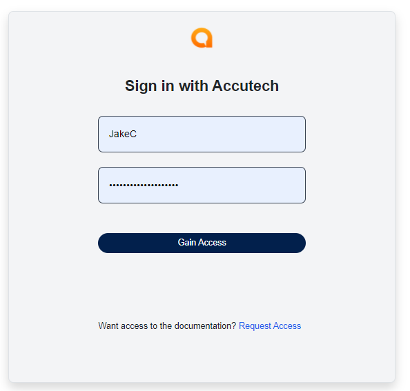
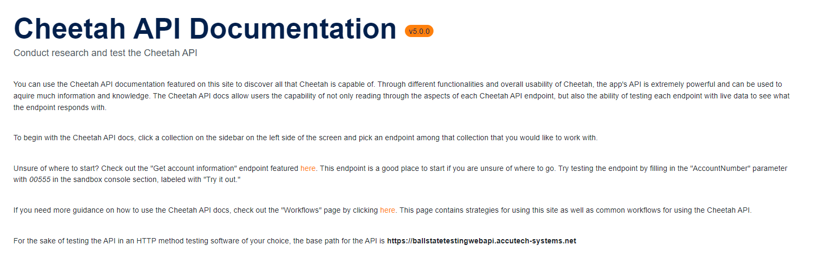
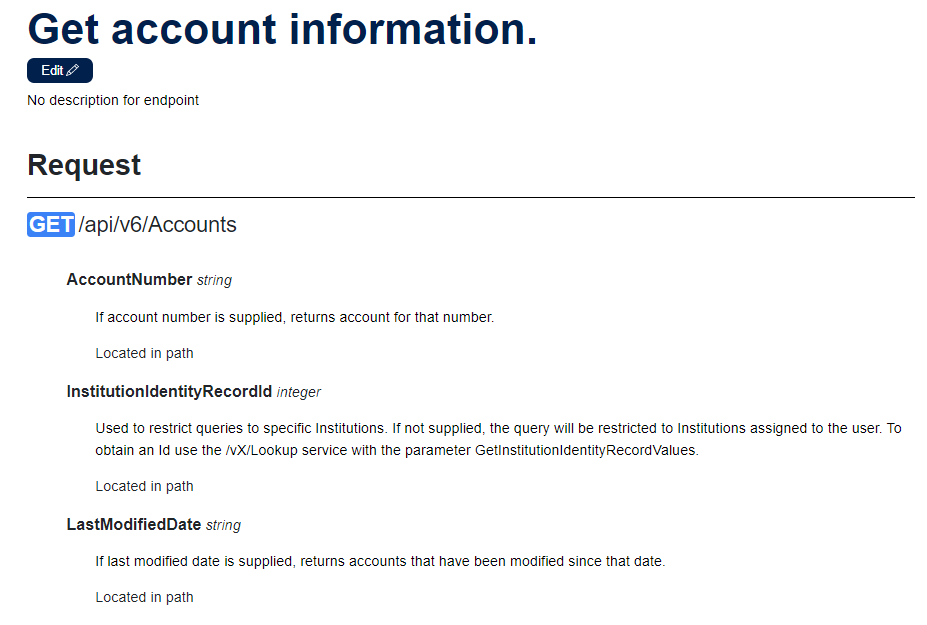
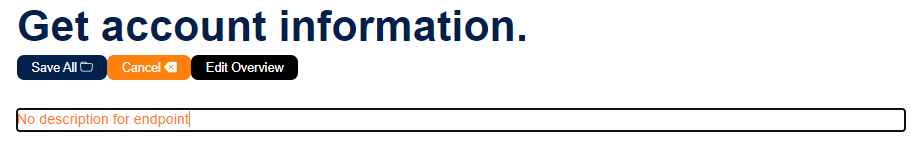
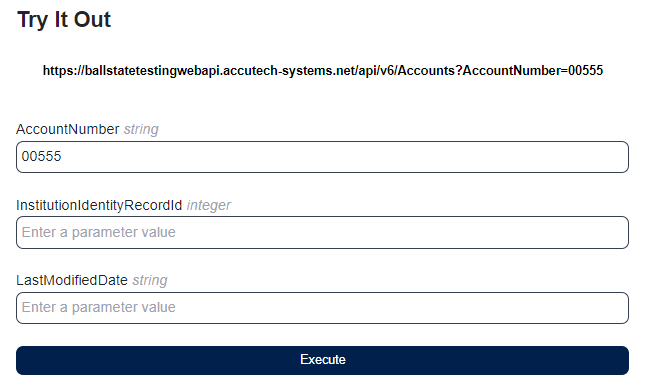
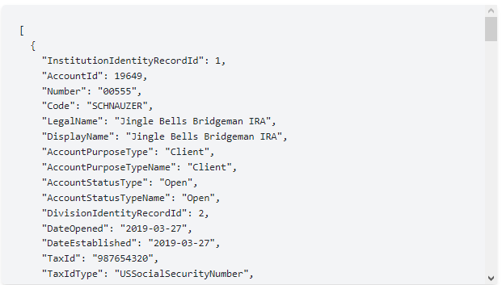
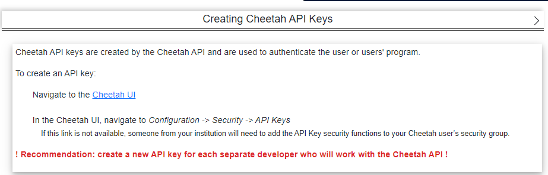

## User Documentation
---
### - Home Page

Opening the software, you will start at the home page, which provides some of the uses that will come or be in the software in the end product. On this page, you will find a login button located at the top right of the page. Click it to go to the login page. A home button will be displayed at the top of the screen at all times on every page for whenever the user wants to return to the main home page. The Home page also features the run data loading button. When the user clicks this button it will either add or update the collections, endpoints, and etc. featured in the documentation with the newest version of the Cheetah API. This is useful when the user knows that an update to the api has occured and the user needs the newest version of the documentation.

#### Page buttons:
- <b>Home:</b> Goes back to the starting page where you would need to go back throgh the login page
- <b>Login:</b> Brings the user to the login page where they gain access if they haven't already
- <b>Run Data Loading:</b> Allows the user to load data in from Accutech's Cheetah swagger page.

---
### - Login Page

On the login page, the user will have the option to log in or request access. Selecting the Gain Access button will make an HTTP Token call to the Cheetah API with the credentials entered in the Username and Password fields. If the username and password are legitimate, the login will go through successfully, and the user will then be taken to the next page which is the references page. If the username and password are incorrect, the Cheetah call will not go through, and the user will be shown an error to check their entered credentials. However, if connection is unable to be made with Accutech servers, or Accutech servers are experiencing an outage, the user will be prompted with an error message explaining this issue. If the user selects the Request Access link, they will be given a form to fill out that will send an email to an email address specified in the back-end. The email will contain the information gathered from the form. After filling out the form, the user can click the Submit Form button and the email will be sent. Currently, to send an email the "Enabled" option in the appSettings.json file in the back-end needs to be set to true. The email address to be sent to is currently set to our professor's email address, for grading purposes.

  
- The user can login with their Accutech username and password

#### Page buttons:
- <b>Home:</b> Goes back to the starting page
- <b>Gain Access:</b> Brings the user to the references page
- <b>Request Access:</b> Opens a modal containing a form that a user can fill out in order to request access to the API
- <b>Submit Form:</b> Submits the form and send an email to an administrator (specified in the back-end)

---
### - References Page

On the references page, the user will first be brought to the references landing page telling the user to select an object link. From there the user can select which object in the Cheetah API they would like to either work with or see the available endpoints of from the sidebar. After the user clicks one of these objects it will drop down with all of the endpoints available in that object. Once the user clicks one of these endpoints they will be brought to a page that lists information about that specific endpoint, including the endpoint's description, parameters, and responses. If the user wishes to edit the description on the endpoint or any of it's parameters to gain a better understanding of what it does, the user can click the edit button, click the endpoint or parameter description, type what they want the description to be, and click the save button. The page will reload with the new endpoint and parameter description. The user can also click the "Edit Overview" button while in edit mode to open a modal that has information about past and present edits. This modal also offers the user the ability to undo or save current edits. If the user wishes to test the endpoint and see what the endpoint would return with given real parameters, the user has the option to execute a call to the Cheetah API by entering parameter values and clicking the "Execute" button in the "Try it out" section on the right of the references page. After executing a call, the response of said call will show up in the modal underneath the parameter input fields.

  
- The References landing page looks like this. From here the user can select an object link in the sidebar on the left, and an endpoint.
- Alternatively, this page features a quick start guide for new users. Users have the option to read and click links to helpful endpoints as well as the workflows page.

  
- Once an endpoint is selected it will bring the user to that endpoint's page with information about the endpoint's parameters and responses
    - In this case, 'Get Account Information' was selected

  
- If a user wants to edit an endpoint or parameter description, they can click the edit button and start typing in endpoint or parameter description area
    - Once a user is done they can click the save button and the change will be saved

  
- If a user wishes to see what edits have been made, while in edit mode they can click the "Edit Overview" button. A modal with listing the items of the page you are currently on will open.
    - The button in the modal will be (orange) if edits were made and (blue) if there are no changes.
    - Selecting an item button will show the original value before new edits were made and the item's current state. 
    - When selecting an item that has been edited (marked orange), the user can choose to press the save locally or undo changes buttons. Pressing the save locally button will update the original value and update the original value pending edits. The user will still need to click the save all button on the edits page to save any changes. Clicking the undo button will undo any edits made for the item and revert it to the original value or last save. 

  
- The user can then input parameters they would like to test
    - In this case the account number parameter is "00555"

  
- After clicking the execute button the user will be given the response in the modal underneath the console.

#### Page buttons:
- <b>Home:</b> Goes back to the starting page
- <b>Execute:</b> Executes a call to the Cheetah API endpoint with the data provided by the user

---
### - Workflows
On the workflows page, the user will be prompted with several different cards that each represent a common workflow used by users. When a user clicks on one of these workflows, a dropdown will open that contains information and a "how to" on that specific workflow.

  
- When a user clicks on a workflow card, a menu similar to this with information about how to execute this workflow will drop down.

#### Page buttons:
- <b>Home:</b> Goes back to the starting page where you would need to go back throgh the login page

---
#### Pages Dropdown Menu (Featured on all pages after logging in):
- <b>References:</b> The Reference option will take you to the references landing page
- <b>Workflows:</b> The Workflows option will take you to the workflows page
- <b>Logout:</b> The Logout option will logout the current user and send the user back to the login page
